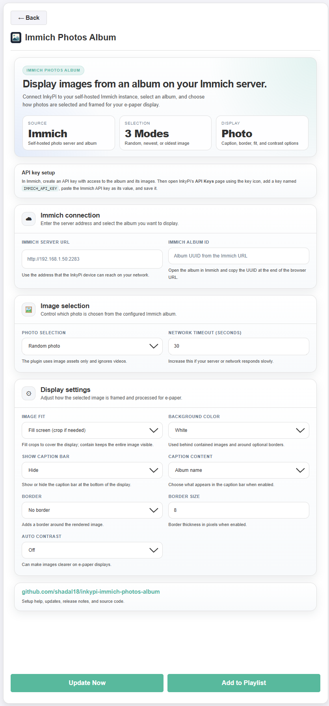

# InkyPi Immich Photos Album

An InkyPi plugin that displays photos from an album on your self-hosted Immich server.

_Immich Photos Album_ is a plugin for [InkyPi](https://github.com/fatihak/InkyPi) that connects to an Immich server using an API key, reads the selected album, chooses an image, and renders it on your e-paper display.

## Install

Use the InkyPi plugin installer with the plugin ID and this repository URL.

```bash
inkypi plugin install immich_photos_album https://github.com/shadal18/inkypi-immich-photos-album
```

## Update

To update the plugin on your InkyPi device:

1. SSH into your InkyPi host.
2. Change into the plugin directory:
   ```bash
   cd ~/InkyPi/src/plugins/immich_photos_album
   ```
3. Run this update command:
   ```bash
   git pull origin main && \
   if [ -d immich_photos_album ]; then \
     rsync -a immich_photos_album/ ./ && \
     rm -rf immich_photos_album; \
   fi && \
   sudo systemctl restart inkypi.service
   ```

If you do not see your changes after updating:

- Confirm you are in the correct plugin folder.
- Hard refresh the InkyPi web UI.
- Check the InkyPi logs for plugin import or runtime errors.
- Confirm the InkyPi device can reach the configured Immich server URL.

## Requirements

- A working InkyPi installation with plugin support.
- A reachable Immich server.
- An Immich API key with permission to read the selected album and its assets.
- The UUID of the Immich album you want to display.
- Network access from the InkyPi device to the Immich server.

## Features

This plugin is an extension for the InkyPi e-paper display frame and includes the following features:

- Displays photos from a selected Immich album.
- Uses an Immich API key stored as an InkyPi environment key.
- Supports random image selection.
- Supports newest and oldest image selection.
- Ignores video assets and uses images only.
- Supports fill mode for a full-screen cropped photo.
- Supports contain mode to show the entire image with letterboxing.
- Configurable black or white background.
- Optional border with configurable padding.
- Optional caption bar.
- Caption modes for album name, filename, date, or asset ID.
- Optional auto contrast for improved e-paper readability.
- Supports horizontal and vertical display orientation.
- Configurable request timeout.

## Settings

The plugin settings page lets you customize:

- Immich server URL.
- Immich album ID.
- InkyPi environment key name for the Immich API key.
- Photo selection mode.
- Image fit mode.
- Background color.
- Show or hide caption bar.
- Caption content mode.
- Show or hide border.
- Border size.
- Auto contrast on or off.
- Request timeout.

## Immich Setup

This plugin uses an Immich API key instead of an album share link.

### Create an Immich API key

1. Open your Immich web interface.
2. Open your account settings.
3. Go to the API Keys section.
4. Create a new API key.
5. Give the key read access to albums and assets.
6. Copy the generated API key.

### Add the key in InkyPi

1. Open the InkyPi front page.
2. Click the **key icon**.
3. Add a new environment key named:
   ```text
   IMMICH_API_KEY
   ```
4. Paste your Immich API key as the value.
5. Save the key.

You can use another environment key name if preferred, but it must match the **InkyPi environment key** setting in the plugin.

### Find the album ID

1. Open the album you want to display in Immich.
2. Look at the browser address bar.
3. Copy the album UUID from the album URL.

For example, an album URL may look similar to:

```text
http://immich.local/albums/12345678-1234-1234-1234-123456789abc
```

The album ID would be:

```text
12345678-1234-1234-1234-123456789abc
```

### Add the plugin in InkyPi

1. Open the InkyPi web UI.
2. Add the **Immich Photos Album** plugin to a playlist or open it directly.
3. Enter your Immich server URL.
4. Paste the album ID.
5. Confirm the environment key name is correct.
6. Configure the display options.
7. Save the plugin settings.
8. Refresh the display or restart InkyPi if needed.

## How it works

The plugin requests the selected album from Immich using the configured API key. It filters the album contents to images, chooses a photo based on the selected mode, downloads the preview image, and formats it for the connected e-paper display.

The plugin uses the display orientation configured in InkyPi and supports either full-screen cropped images or whole-image letterboxed rendering.

## Notes and limitations

- The Immich server URL must be reachable from the InkyPi device.
- Use a local network URL or hostname instead of `localhost` unless Immich is running on the same Raspberry Pi.
- The API key should have only the permissions needed to read albums and images.
- Videos are ignored.
- Very large albums can take longer to load and process.
- Random selection can occasionally show the same photo again on later refreshes.
- If your Immich server uses a self-signed HTTPS certificate, the Pi must trust that certificate or requests may fail.

## Troubleshooting

- **Missing environment key**
  - Confirm that `IMMICH_API_KEY` exists in InkyPi.
  - Confirm that the name in InkyPi matches the environment key name configured in the plugin settings.

- **Could not connect to Immich**
  - Confirm the Immich server URL is correct.
  - Confirm the server is running.
  - Confirm that the InkyPi device can reach the server over the network.
  - Check whether your server URL needs a port, such as `http://192.168.1.50:2283`.

- **No image assets found**
  - Confirm the album ID is correct.
  - Confirm the selected album contains photos.
  - Videos are ignored by this plugin.

- **Failed to download selected photo**
  - Confirm the API key has permission to access album assets.
  - Check the InkyPi logs for the specific HTTP or connection error.
  - Verify that Immich is not blocking the InkyPi device.

## Security and privacy

- The plugin connects directly to your configured Immich server.
- Your Immich API key is stored as an InkyPi environment key instead of in the plugin settings.
- Photos are downloaded only to render the current image on the InkyPi display.
- The plugin does not upload photos or send your Immich credentials to any external service.

## Repository

GitHub repository:

[https://github.com/shadal18/inkypi-immich-photos-album](https://github.com/shadal18/inkypi-immich-photos-album)

## Screenshots

- Main plugin display showing a photo from an Immich album.
- Plugin settings screen.

<p align="center">
  
  
</p>
